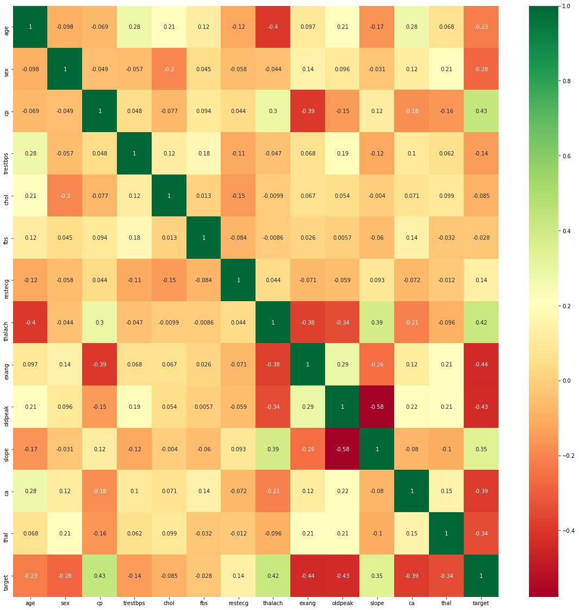
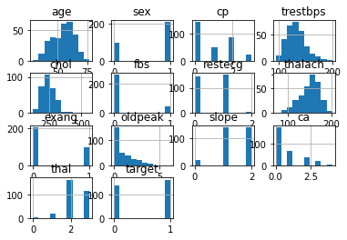
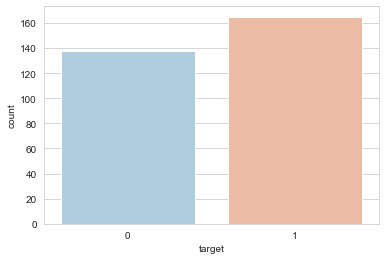
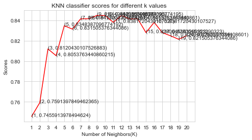

```python
import numpy as np
import pandas as pd
import matplotlib.pyplot as plt
from matplotlib import rcParams
from matplotlib.cm import rainbow
%matplotlib inline
import warnings
warnings.filterwarnings('ignore')
```


```python
from sklearn.neighbors import KNeighborsClassifier
from sklearn.tree import DecisionTreeClassifier
from sklearn.ensemble import RandomForestClassifier
```


```python
df=pd.read_csv("heart.csv")
```


```python
df.info()
```

    <class 'pandas.core.frame.DataFrame'>
    RangeIndex: 303 entries, 0 to 302
    Data columns (total 14 columns):
     #   Column    Non-Null Count  Dtype  
    ---  ------    --------------  -----  
     0   age       303 non-null    int64  
     1   sex       303 non-null    int64  
     2   cp        303 non-null    int64  
     3   trestbps  303 non-null    int64  
     4   chol      303 non-null    int64  
     5   fbs       303 non-null    int64  
     6   restecg   303 non-null    int64  
     7   thalach   303 non-null    int64  
     8   exang     303 non-null    int64  
     9   oldpeak   303 non-null    float64
     10  slope     303 non-null    int64  
     11  ca        303 non-null    int64  
     12  thal      303 non-null    int64  
     13  target    303 non-null    int64  
    dtypes: float64(1), int64(13)
    memory usage: 33.3 KB
    


```python
df.describe()
```


<div>
<style scoped>
    .dataframe tbody tr th:only-of-type {
        vertical-align: middle;
    }

    .dataframe tbody tr th {
        vertical-align: top;
    }

    .dataframe thead th {
        text-align: right;
    }
</style>
<table border="1" class="dataframe">
  <thead>
    <tr style="text-align: right;">
      <th></th>
      <th>age</th>
      <th>sex</th>
      <th>cp</th>
      <th>trestbps</th>
      <th>chol</th>
      <th>fbs</th>
      <th>restecg</th>
      <th>thalach</th>
      <th>exang</th>
      <th>oldpeak</th>
      <th>slope</th>
      <th>ca</th>
      <th>thal</th>
      <th>target</th>
    </tr>
  </thead>
  <tbody>
    <tr>
      <th>count</th>
      <td>303.000000</td>
      <td>303.000000</td>
      <td>303.000000</td>
      <td>303.000000</td>
      <td>303.000000</td>
      <td>303.000000</td>
      <td>303.000000</td>
      <td>303.000000</td>
      <td>303.000000</td>
      <td>303.000000</td>
      <td>303.000000</td>
      <td>303.000000</td>
      <td>303.000000</td>
      <td>303.000000</td>
    </tr>
    <tr>
      <th>mean</th>
      <td>54.366337</td>
      <td>0.683168</td>
      <td>0.966997</td>
      <td>131.623762</td>
      <td>246.264026</td>
      <td>0.148515</td>
      <td>0.528053</td>
      <td>149.646865</td>
      <td>0.326733</td>
      <td>1.039604</td>
      <td>1.399340</td>
      <td>0.729373</td>
      <td>2.313531</td>
      <td>0.544554</td>
    </tr>
    <tr>
      <th>std</th>
      <td>9.082101</td>
      <td>0.466011</td>
      <td>1.032052</td>
      <td>17.538143</td>
      <td>51.830751</td>
      <td>0.356198</td>
      <td>0.525860</td>
      <td>22.905161</td>
      <td>0.469794</td>
      <td>1.161075</td>
      <td>0.616226</td>
      <td>1.022606</td>
      <td>0.612277</td>
      <td>0.498835</td>
    </tr>
    <tr>
      <th>min</th>
      <td>29.000000</td>
      <td>0.000000</td>
      <td>0.000000</td>
      <td>94.000000</td>
      <td>126.000000</td>
      <td>0.000000</td>
      <td>0.000000</td>
      <td>71.000000</td>
      <td>0.000000</td>
      <td>0.000000</td>
      <td>0.000000</td>
      <td>0.000000</td>
      <td>0.000000</td>
      <td>0.000000</td>
    </tr>
    <tr>
      <th>25%</th>
      <td>47.500000</td>
      <td>0.000000</td>
      <td>0.000000</td>
      <td>120.000000</td>
      <td>211.000000</td>
      <td>0.000000</td>
      <td>0.000000</td>
      <td>133.500000</td>
      <td>0.000000</td>
      <td>0.000000</td>
      <td>1.000000</td>
      <td>0.000000</td>
      <td>2.000000</td>
      <td>0.000000</td>
    </tr>
    <tr>
      <th>50%</th>
      <td>55.000000</td>
      <td>1.000000</td>
      <td>1.000000</td>
      <td>130.000000</td>
      <td>240.000000</td>
      <td>0.000000</td>
      <td>1.000000</td>
      <td>153.000000</td>
      <td>0.000000</td>
      <td>0.800000</td>
      <td>1.000000</td>
      <td>0.000000</td>
      <td>2.000000</td>
      <td>1.000000</td>
    </tr>
    <tr>
      <th>75%</th>
      <td>61.000000</td>
      <td>1.000000</td>
      <td>2.000000</td>
      <td>140.000000</td>
      <td>274.500000</td>
      <td>0.000000</td>
      <td>1.000000</td>
      <td>166.000000</td>
      <td>1.000000</td>
      <td>1.600000</td>
      <td>2.000000</td>
      <td>1.000000</td>
      <td>3.000000</td>
      <td>1.000000</td>
    </tr>
    <tr>
      <th>max</th>
      <td>77.000000</td>
      <td>1.000000</td>
      <td>3.000000</td>
      <td>200.000000</td>
      <td>564.000000</td>
      <td>1.000000</td>
      <td>2.000000</td>
      <td>202.000000</td>
      <td>1.000000</td>
      <td>6.200000</td>
      <td>2.000000</td>
      <td>4.000000</td>
      <td>3.000000</td>
      <td>1.000000</td>
    </tr>
  </tbody>
</table>
</div>


```python
df.isnull().sum()
```


    age         0
    sex         0
    cp          0
    trestbps    0
    chol        0
    fbs         0
    restecg     0
    thalach     0
    exang       0
    oldpeak     0
    slope       0
    ca          0
    thal        0
    target      0
    dtype: int64


```python
#feature selection
```


```python
import seaborn as sns
corrmat=df.corr()
top_corr_features=corrmat.index
plt.figure(figsize=(20,20))
g=sns.heatmap(df[top_corr_features].corr(),annot=True,cmap="RdYlGn")

```


    

    


```python
df.hist()
```


    array([[<AxesSubplot:title={'center':'age'}>,
            <AxesSubplot:title={'center':'sex'}>,
            <AxesSubplot:title={'center':'cp'}>,
            <AxesSubplot:title={'center':'trestbps'}>],
           [<AxesSubplot:title={'center':'chol'}>,
            <AxesSubplot:title={'center':'fbs'}>,
            <AxesSubplot:title={'center':'restecg'}>,
            <AxesSubplot:title={'center':'thalach'}>],
           [<AxesSubplot:title={'center':'exang'}>,
            <AxesSubplot:title={'center':'oldpeak'}>,
            <AxesSubplot:title={'center':'slope'}>,
            <AxesSubplot:title={'center':'ca'}>],
           [<AxesSubplot:title={'center':'thal'}>,
            <AxesSubplot:title={'center':'target'}>, <AxesSubplot:>,
            <AxesSubplot:>]], dtype=object)


    

    


```python
sns.set_style('whitegrid')
sns.countplot(x='target',data=df,palette='RdBu_r')
```


    <AxesSubplot:xlabel='target', ylabel='count'>


    

    


DataProcessing


```python
num_var=[feature for feature in df.columns if df[feature].dtypes!='O']
```


```python
num_var
```


    ['age',
     'sex',
     'cp',
     'trestbps',
     'chol',
     'fbs',
     'restecg',
     'thalach',
     'exang',
     'oldpeak',
     'slope',
     'ca',
     'thal',
     'target']


```python
dataset = pd.get_dummies(df, columns = ['sex', 'cp', 'fbs', 'restecg', 'exang', 'slope', 'ca', 'thal'])
```


```python

```


```python
from sklearn.model_selection import train_test_split
from sklearn.preprocessing import StandardScaler
```


```python
standardScaler=StandardScaler()
columns_to_scale=['age','trestbps','chol','thalach','oldpeak']
dataset[columns_to_scale]=standardScaler.fit_transform(dataset[columns_to_scale],2)
```


```python
dataset.head()
```


<div>
<style scoped>
    .dataframe tbody tr th:only-of-type {
        vertical-align: middle;
    }

    .dataframe tbody tr th {
        vertical-align: top;
    }

    .dataframe thead th {
        text-align: right;
    }
</style>
<table border="1" class="dataframe">
  <thead>
    <tr style="text-align: right;">
      <th></th>
      <th>age</th>
      <th>trestbps</th>
      <th>chol</th>
      <th>thalach</th>
      <th>oldpeak</th>
      <th>target</th>
      <th>sex_0</th>
      <th>sex_1</th>
      <th>cp_0</th>
      <th>cp_1</th>
      <th>...</th>
      <th>slope_2</th>
      <th>ca_0</th>
      <th>ca_1</th>
      <th>ca_2</th>
      <th>ca_3</th>
      <th>ca_4</th>
      <th>thal_0</th>
      <th>thal_1</th>
      <th>thal_2</th>
      <th>thal_3</th>
    </tr>
  </thead>
  <tbody>
    <tr>
      <th>0</th>
      <td>0.952197</td>
      <td>0.763956</td>
      <td>-0.256334</td>
      <td>0.015443</td>
      <td>1.087338</td>
      <td>1</td>
      <td>0</td>
      <td>1</td>
      <td>0</td>
      <td>0</td>
      <td>...</td>
      <td>0</td>
      <td>1</td>
      <td>0</td>
      <td>0</td>
      <td>0</td>
      <td>0</td>
      <td>0</td>
      <td>1</td>
      <td>0</td>
      <td>0</td>
    </tr>
    <tr>
      <th>1</th>
      <td>-1.915313</td>
      <td>-0.092738</td>
      <td>0.072199</td>
      <td>1.633471</td>
      <td>2.122573</td>
      <td>1</td>
      <td>0</td>
      <td>1</td>
      <td>0</td>
      <td>0</td>
      <td>...</td>
      <td>0</td>
      <td>1</td>
      <td>0</td>
      <td>0</td>
      <td>0</td>
      <td>0</td>
      <td>0</td>
      <td>0</td>
      <td>1</td>
      <td>0</td>
    </tr>
    <tr>
      <th>2</th>
      <td>-1.474158</td>
      <td>-0.092738</td>
      <td>-0.816773</td>
      <td>0.977514</td>
      <td>0.310912</td>
      <td>1</td>
      <td>1</td>
      <td>0</td>
      <td>0</td>
      <td>1</td>
      <td>...</td>
      <td>1</td>
      <td>1</td>
      <td>0</td>
      <td>0</td>
      <td>0</td>
      <td>0</td>
      <td>0</td>
      <td>0</td>
      <td>1</td>
      <td>0</td>
    </tr>
    <tr>
      <th>3</th>
      <td>0.180175</td>
      <td>-0.663867</td>
      <td>-0.198357</td>
      <td>1.239897</td>
      <td>-0.206705</td>
      <td>1</td>
      <td>0</td>
      <td>1</td>
      <td>0</td>
      <td>1</td>
      <td>...</td>
      <td>1</td>
      <td>1</td>
      <td>0</td>
      <td>0</td>
      <td>0</td>
      <td>0</td>
      <td>0</td>
      <td>0</td>
      <td>1</td>
      <td>0</td>
    </tr>
    <tr>
      <th>4</th>
      <td>0.290464</td>
      <td>-0.663867</td>
      <td>2.082050</td>
      <td>0.583939</td>
      <td>-0.379244</td>
      <td>1</td>
      <td>1</td>
      <td>0</td>
      <td>1</td>
      <td>0</td>
      <td>...</td>
      <td>1</td>
      <td>1</td>
      <td>0</td>
      <td>0</td>
      <td>0</td>
      <td>0</td>
      <td>0</td>
      <td>0</td>
      <td>1</td>
      <td>0</td>
    </tr>
  </tbody>
</table>
<p>5 rows × 31 columns</p>
</div>


```python
X=dataset.drop(['target'],axis=1)
y=dataset['target']
```


```python
from sklearn.model_selection import cross_val_score
knn_scores=[]
for k in range(1,21):
    knn_classifier=KNeighborsClassifier(n_neighbors=k)
    score=cross_val_score(knn_classifier,X,y,cv=10)
    knn_scores.append(score.mean())
```


```python
plt.plot([k for k in range(1,21)],knn_scores,color='red')
for i in range(1,21):
    plt.text(i,knn_scores[i-1],(i,knn_scores[i-1]))
plt.xticks([i for i in range(1,21)])
plt.xlabel("Number of Neighbors(K)")
plt.ylabel("Scores")
plt.title("KNN classifier scores for different k values")
```


    Text(0.5, 1.0, 'KNN classifier scores for different k values')


    

    


```python
knn_classifier=KNeighborsClassifier(n_neighbors=12)
score=cross_val_score(knn_classifier,X,y,cv=10)
```


```python
score.mean()
```


    0.8448387096774195


```python
randomforest_classifier= RandomForestClassifier(n_estimators=10)

score=cross_val_score(randomforest_classifier,X,y,cv=10)
```


```python
score.mean()
```


    0.8149462365591399


```python

```
